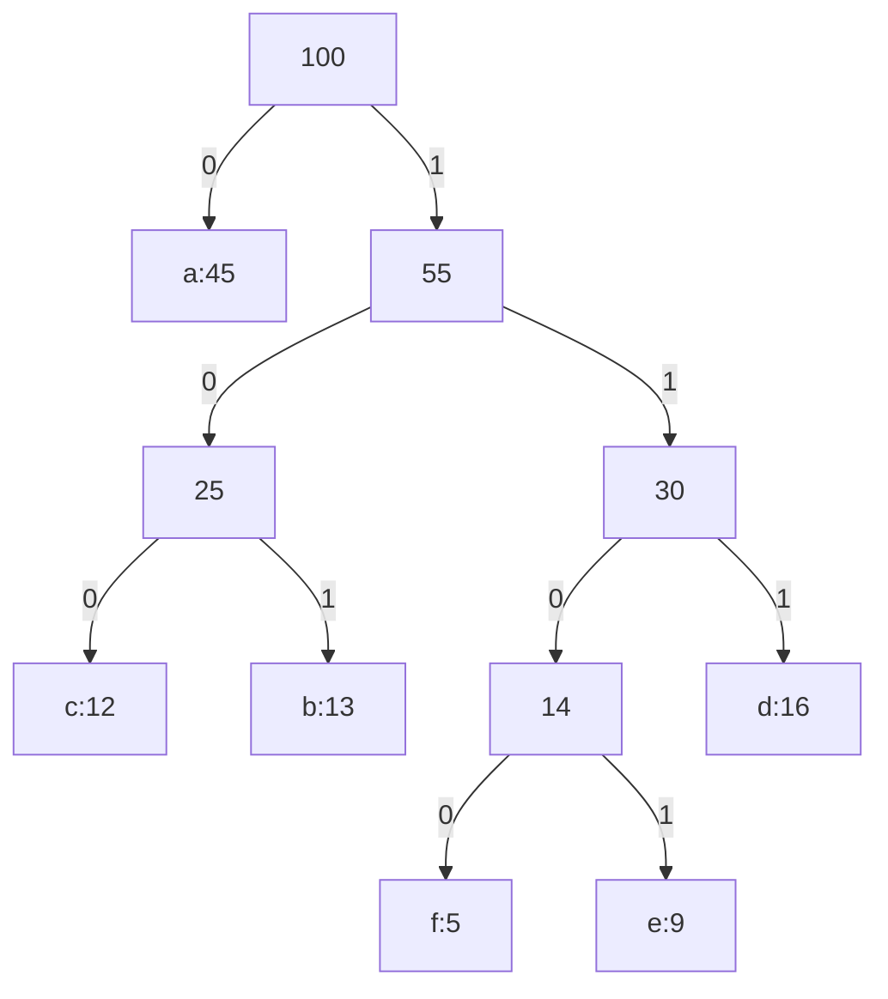

chapter 16* p. 414 - 446
[[Dynamic Programming#]]

---
GM makes a ==local optimal choice== in the hope that this choice will lead to a ==globally optimal solution==. It will ==not== always yield optimal solution.

We shall arrive at the GM ==by first considering a DP approach== and then showing that we can ==always make greedy choices== to arrive at an optimal solution.

---
## Activity-Selection Problem

>[!info]
>given
>
>1. n proposed activities: $S=\{a_1,a_2,...,a_n\}$
>2. for each $a_i$, it has a start time $s_i$ and finish time $f_i$, where $0\le s_i\le f_i\le\infty$
>3. $a_i$ takes $[s_i,f_i)$
>4. two activities are compatible if the intervals are not overlap
>5. assume activities are sorted in monotonically increasing order of finish time $f_i$

| i     | 1   | 2   | 3   | 4   | 5   | 6   | 7   | 8   | 9   | 10  | 11  |
| ----- | --- | --- | --- | --- | --- | --- | --- | --- | --- | --- | --- |
| $s_i$ | 1   | 3   | 0   | 5   | 3   | 5   | 6   | 8   | 8   | 2   | 12  |
| $f_i$ | 4   | 5   | 6   | 7   | 9   | 9   | 10  | 11  | 12  | 14  | 16    |

---
### optimal structure

denote $S_{ij}$ the set before $a_i$ finishes and after $a_j$ starts. We want to find a maximum set of mutually compatible activities in $S_{ij}$. Suppose the set is $A_{ij}$ including some activities $a_k$. By including $a_k$ in an optimal solution, we are left with two subproblems:

1. finding mutually compatible activities in $S_{ik}$
2. finding mutually compatible activities in $S_{kj}$

Let $A_{ik}=A_{ij}\cap S_{ik}$ and $A_{kj}=A_{ij}\cap S_{kj}$, 
then 
- $A_{ij}=A_{ik}\cup \{a_k\}\cup A_{kj}$ 
- $|A_{ij}|=|A_{ik}|+1+|A_{kj}|$ 

we did ==not== know that if $a_k$ is in an optimal solution, we would have to examine all activities in $S_{ij}$ to find the one to choose.

$$
c[i,j]=
\begin{cases}
0&if\,S_{ij}=\emptyset \\
\underset{a_k\in S_{ij}}{max}\{c[i,k]+c[k,j]+1\}&if\,S_{ij}\not=\emptyset
\end{cases}
$$
---
### Greedy choice

Here, we should choose an activity that ==leaves the resource available for as many other activities as possible==, which is the first one to finish. 

If we make the greedy choice, subproblem#1 has been solved, and we only need to find the activity starts after $a_1$ finishes since $a_1$ is the very first one to finish.

>[!info]
>Theorem 16.1 
>Consider any nonempty subproblem $S_k$, and let $a_m$ be an activity in $S_k$ with the earliest finish time. Then $a_m$ is included in some maximum-size subset of mutually compatible activities of $S_k$

>[!Term]
>Top-down: make a choice and then solve the subproblem (GA)
>
>Bottom-up: solving subproblems before making a choice (DP)

---
### recursive greedy algorithm

Recursive-activity-selector(s, f, k, n)
	m = k + 1 # point to the next
	while m $\le$ n and s[m] < f[k] # traverse the start set to find the earliest one after the latest finish time
		m = m + 1  
	if m $\le$ n # when the while loop breaks, check if it hits the end
		return {$a_m$}$\cup$ Recursive-activity-selector(s, f, m, n) # if not, join this in the solution and find the next
	else return $\emptyset$ # hitting the end, solution is done, terminate the procedure.

>[!info]
>s and f are arrays representing start and finish times
>k defines the subproblem $S_k$ to be solved
>n is the size of the original problem

The running time of the call is $\Theta(n)$ since each activity is examined exactly once in the while loop.

---
### Iterative greedy algorithm

It is easy to transform a tail-recursive procedure to an iterative form.

Greedy-activity-selector(s, f)
	n = s.length
	A = {$a_1$}
	k = 1
	for m = 2 to n
		if s[m] $\ge$ f[k]
			A = A $\cup$ {$a_m$}
			k = m
	return A

---
## elements of the greedy strategy

a greedy algorithm obtains an optimal solution by making a sequence of local optimal choice, and hope the result is global optimal.

1. Determine the optimal substructure
2. develop a recursive solution
3. show that if we make the greedy choice, then only one subproblem remains
4. prove that it is always safe to make the greedy choice
5. develop a recursive algorithm that implements the greedy strategy
6. convert the recursive algorithm to an iterative algorithm

more generally
1. cast the optimization problem as one in which we make a choice and are left with one subproblem to solve
2. prove that there is always an optimal solution to the original problem that makes the greedy choice, so that the greedy choice is always safe
3. demonstrate optimal substructure by showing that, having made the greedy choice, what remains is a subproblem with the property that ==if we combine an optimal solution to the subproblem with the greedy choice we have made, we arrive at an optimal solution to the original problem==

Beneath every GA, there is almost always a more cumbersome DP solution.

How can we tell whether a GA will solve a particular optimization problem? No way works all the time, but the ==greedy-choice property== and ==optimal substructure== are the two key ingredients.

### Greedy-choice property

	We can assemble a globally optimal solution by making locally optimal(greedy) choices.

Here is where GA differ from DP. 

In DP, we make a choice at each step, but the choice usually depends on ==the solutions to subproblems==. Consequently, we solve DP problems in a ==bottom-up== manner, ==progressing from smaller subproblems to larger subproblems.== 

In GA, we make whatever choice seems best at the moment and then solve the subproblem that remains. The choice made by a GA may depend on choices so far, ==but it cannot depend on any future choices or on the solutions to subproblems.== 

>[!info]
>DP: subproblem -> choice (bottom up)
>GA: choice -> subproblem (top-down)

### optimal substructure

	A problem exhibits optimal substructure if an optimal solution to the problem contains within it optimal solutions to subproblems.

This property is a key ingredient of assessing the applicability of DP as well as GA.

For example, in an activity-selection problem, if an optimal solution to subproblem $S_{ij}$ includes an activity $a_k$, then it must also contain optimal solutions to the subproblems $S_{ik}$ and $S_{kj}$. 
>[!note]
>Remind of D & C, the main problem can be divided into subproblems in same structure and can be solved by same algorithm.

All we really need to do is argue that an optimal solution to the subproblem, combined with the greedy choice already made, ==yields an optimal solution to the original problem==. This scheme implicitly uses ==induction== on the subproblems to prove that ==making the greedy choice at every step produces an optimal solution==.

---
## GA vs. DP

Both GA and DP exploit optimal substructure, so one might mistakenly choose the wrong method.

To illustrate the subtleties between the two techniques, here are two variants of a classical optimization problem.

### 0-1 knapsack problem
>[!info]
>A thief robbing a store finds n items. The ith item is worth $v_i$ dollars and weighs $w_i$ pounds, where $v_i$ and $w_i$ are integers. The thief wants to take as valuable a load as possible, but he can carry at most W pounds in his knapsack, for some integer W. Which items should he take?

	0-1 implies that, for each item, the thief can either take it or not, he cannot take a fractional amount of the item or take it more than once. There is a term "fractional knapsack problem" for what was described before.

Optimal substructure property: 
- 0-1
	If we remove item j from this load, the remaining load must be the most valuable load weighing at most W-$w_j$ that the thief can take from the n-1 original items excluding j.
- fractional
	If we remove a weight w of one item j from the optimal load, the remaining load must be the most valuable load weighing at most W-w that the thief can take from the n-1 original items plus $w_j-w$ pounds of item j.

>[!warning]
>We can only solve the fractional KP by a GA, but we cannot solve the 0-1 problem by it.

### fractional

1. compute the value per pound $v_i/w_i$ for each item
2. take as much as possible of the item with the greatest value per pound
3. take the item with the next greatest value per pound it the most valuable one is exhausted

By sorting the items by value per pound, the GA runs in $O(n\,lg\,n)$ time. 

### 0-1

counterexample:
	W = 50 pounds
	$w_1$ = 10 pounds    $v_1$ = $60      vpm = 6
	$w_2$ = 20 pounds    $v_2$ = $100    vpm = 5
	$w_3$ = 30 pounds    $v_3$ = $120    vpm = 4

GA will take item#1 first, then item#2, and left no space for item#3. End up with $160.
However, the optimal solution will take item#2 and #3, which ends with $220.

---
## Huffman codes

Huffman codes is an effective compress tool, which I have learned and implement in CMPUT 274. It typically saves 20% to 90% space.

Huffman's GA uses a frequency table to build up an optimal way of representing each character as a binary string.

### Example

Suppose we have a 100,000 character data file. Here is the frequency table:
|                          | a   | b   | c   | d   | e    | f    |
| ------------------------ | --- | --- | --- | --- | ---- | ---- |
| Freq(in thousands)       | 45  | 13  | 12  | 16  | 9    | 5    |
| Fixed-length codeword    | 000 | 001 | 010 | 011 | 100  | 101  |
| variable-length codeword | 0   | 101 | 100 | 111 | 1101 | 1100 |

We consider the problem of designing a ==binary character code== where each character is represented by a unique binary string --- codeword.

If we use a fixed-length code, it requires 300,000 bits to code the entire file.

If we use a variable-length code, it requires $(45\cdot1+13\cdot3+12\cdot3+16\cdot3+9\cdot4+5\cdot4)\cdot1,000=224,000$ bits, which saves approximately 25%.

### Prefix codes

	No codeword is also a prefix of some other codeword.
==Prefix codes can always achieve the optimal data compression among any character code.== And so we suffer ==no loss of generality== by restricting our attention to prefix codes.

Encoding
- concatenate the codewords representing each character of the file
	- we can easily distinguish the corresponding character since it consists of prefix codes
	- e.g. abc = 0 101 100 = 0101100

Decoding
- unbalanced binary tree
	- 0: go to the left child
	- 1: go to the right child

An optimal code for a file is always represented by a ==full binary tree==, in which ==every nonleaf node has two children.== (It can be unbalanced) 

>[!info]
>If $\mathcal C$ is the alphabet from which characters are drawn and all character frequencies are positive, then the tree for an optimal prefix code has, exactly $|\mathcal C|$ leaves, one fore each letter of the alphabet, and exactly $|\mathcal C|-1$ internal codes.

- T: the tree
- c: character
- C: alphabet
- c.freq: frequency of c
- $d_T(c)$: depth of c's leaf, also ==the length of the codeword for character c==

then, the number of bits required to encode the file is
$$
B(T)=\underset{c\in C}{\sum}c.freq\cdot d_T(c)
$$
which we define as the ==cost== for the tree T

### constructing a Huffman code

Huffman invented a GA that constructs an optimal prefix code called a Huffman code. 